# PacaPounce — Alpaca AI Trading Agents Hackathon submission

> **Team:** a-meowmeow

> **Tagline:** AI hunts. Alpaca MCP verifies. PacaPounce trades only when the
> opportunity survives.

Event: [Alpaca AI Trading Agents Hackathon](https://lablab.ai/ai-hackathons/alpaca-ai-trading-agents-hackathon)

The internal `veto` package and `veto-*` broker client IDs remain stable so
PacaPounce can reconcile existing paper orders safely across restarts. Public
runtime configuration uses the `PACAPOUNCE_*` namespace.

## Paste-ready short description

PacaPounce is an autonomous, paper-only hybrid trading agent built around a simple
idea: generating a plausible trade is easy; proving that the trade deserves
capital is the hard part. An LLM proposes a compact intent, but it never chooses
contracts or sends orders. Deterministic code resolves real SPY/QQQ option
chains through Alpaca MCP, measures liquidity and variance-risk-premium edge,
and sizes against live options buying power under a disclosed full-capital
tournament objective. It submits only atomic multi-leg orders that pass every
gate. A live OPRA monitor then reconciles Alpaca positions every 30 seconds and
manages fills and deterministic exits. The 8%-annual objective remains a visible
benchmark rather than a tournament stop. Every proposal, veto, order, fill, and
P&L result is auditable, and MCP tool usage is counted. A second, independently
tested Paper-Staging lane scans 30 liquid Nasdaq stocks once at 15:45 ET for a
long-trend RSI(2) mean-reversion setup. Python computes its signal, 0.5%-risk
size, 2×ATR broker stop, and EMA5/three-session exit; Poe reviews only timestamped
Alpaca news for event risk and writes the thesis.

## The story

Most trading-agent demos optimize the visible part: a model writes an
impressive market thesis and emits a trade. PacaPounce optimizes the part that fails
quietly in production: whether the proposed trade is executable, economically
positive after friction, appropriately sized, and still inside the portfolio's
return and risk budget.

The project began with a real counterexample. A defined-risk SPY credit spread
passed the familiar safety checklist—liquid contracts, fresh quotes, capped
loss, limit order—and still had negative expected value. That failure led to
PacaPounce's core design:

1. Let the model express a thesis and intent.
2. Never let the model invent a strike, quote, Greek, quantity, or order ID.
3. Resolve contracts from live Alpaca data.
4. Evaluate the whole payoff distribution and friction deterministically.
5. Execute only after every operational and economic gate passes.
6. Reconcile the result against Alpaca, not against a local story about what
   supposedly happened.

The result is not an oracle. It is an autonomous decision system designed to
say **no** for explicit, testable reasons.

## How the agent works

```mermaid
flowchart LR
    S[MCP session supervisor] -->|entry permitted| R[MCP regime brief]
    S -->|closed, pending, capped| X[Wait or stop without Poe call]
    R -->|returns, RV20, ATM IV, IV/RV| A[LLM thesis]
    A --> B[Strict intent JSON]
    B --> C[Deterministic contract builder]
    C -->|Alpaca MCP| D[Quotes, chain, Greeks, bars, account]
    D --> E[Operational gates]
    E --> F[Economic EV gate]
    F --> G[Fractional Kelly + 8% target cap]
    G -->|approved| H[Atomic paper mleg order]
    G -->|vetoed| I[Reason + counterfactual ledger]
    H --> J[30-second OPRA monitor]
    J --> K[Profit, loss, pin-risk, and daily-target exits]
    K -->|Alpaca is source of truth| L[P&L + dashboard + audit trail]
    S -->|15:45, option capital clear| M[NDX30 SIP mean-reversion scan]
    M --> N[Alpaca get_news + one AI event review]
    N --> O[Paper stock OTO + broker stop]
    O --> J
```



### Second Paper strategy — independently tested fallback

`NDX30_MR_01` is not a free-form LLM idea. Its frozen numerical policy is price
above a rising SMA200 plus Wilder RSI(2) below 10, ranked once per normal session.
It risks 0.5% of equity at a 2×ATR14 stop, caps one name at 20% notional, permits
one new stock entry/day and three concurrent positions, then exits above EMA5 or
after three regular sessions. Options and stock entries are mutually exclusive
while either lane has reserved capital.

The 2024 SIP OOS staging card produced 146 trades, +4.98%, PF 1.394, Sharpe 1.353,
53.4% wins and 1.82% maximum drawdown after 3 bps modeled on both sides. A 2023
screen was positive but below the strict promotion thresholds, so the dashboard
calls this **Paper Staging**, not proven live alpha.
The compact evidence card is `data/ndx30_mr_validation.json` and records zero
order calls during research.

| Same fallback capital | Before strategy 2 | After strategy 2 | Increment |
|---|---:|---:|---:|
| 2024 OOS, $100k start | $100,000.00 | $104,975.26 | +$4,975.26 (+4.975%) |
| Earlier 2023 screen | $100,000.00 | ~$103,670.00 | +3.67% (strict card failed) |

“Before” means the fallback allocation stays idle. This is not presented as an
exact strategy-1-versus-combined portfolio replay: live capital interlock blocks
the stock lane whenever an option spread or opening order has reserved capital.

The AI receives only the selected candidate, computed indicators, fixed order
plan, and timestamped `get_news` output. That feed is not an earnings calendar;
the submission explicitly reports `earnings calendar independently verified =
false` instead of implying that an unverified LLM web search is a hard risk gate.

Read-only end-to-end prompt replay (2026-08-28, zero order calls): the completed
30-symbol scan selected `MDLZ` at 62.37 with RSI(2) 7.23, rising SMA200
58.28/58.24, EMA5 62.88 and ATR14 1.16. Deterministic sizing produced 214 shares
and a 60.04 broker stop. Alpaca `get_news` returned no articles in the supplied
four-day interval. Poe returned:

```json
{
  "decision": "approve",
  "thesis": "MDLZ presents an oversold mean-reversion opportunity with RSI(2) at 7.23 above a rising 200-day moving average and no adverse news reported.",
  "event_risk": "none observed in supplied news",
  "invalidation": "Price reaches the broker stop at 60.04."
}
```

That approval is still not an order: live code rechecks broker state, sends the
Paper OTO, then requires `get_orders` to return its client ID and Alpaca order ID.

### Session lifecycle before each proposal

The autonomous loop starts from broker truth, not from a Python counter. Before
calling Poe it uses Alpaca MCP to process five named controls in order:

1. **Trading session** — `get_clock` and `get_calendar` wait before the regular
   open and pause at the actual close, including shortened sessions. MCP
   `next_open` keeps the same process resident across nights, holidays, and weekends.
2. **Pending-order lock** — `get_orders(status=open)` blocks new proposals while
   an opening or closing order is unresolved.
3. **Restart-safe trade count** — `get_orders(status=all)` counts unique filled
   parent PacaPounce opening orders since the broker day's midnight, and
   `get_account_activities(FILL)` independently corroborates child-leg fills.
   Parent grouping prevents two legs from becoming two trades. Order-chase
   revisions share `veto-open-YYYYMMDD-<decision>-rN`, so they count once.
4. **Live exposure** — `get_all_positions` reconstructs current option spreads
   and duplicate symbols.
5. **Objective budget** — `get_account_info` derives daily P&L and the geometric
   8%-annual benchmark.

The snapshot is refreshed again immediately before an approved order is sent.
Any MCP failure is fail-closed. This makes the daily cap restart-safe and removes
the race where a second proposal could begin while an opening order is pending.

For normal operation, `run.py --loop` bundles this entry supervisor with the
deterministic paper risk monitor and a 60-second live dashboard builder. It starts
and supervises both helpers, atomically refreshes the browser-reloading snapshot,
and writes one final broker snapshot at market close. The parent process then
sleeps toward MCP `next_open` and automatically starts a new daily session. A
monitor startup failure blocks entries. Reaching
the target or daily cap locks proposals while monitoring continues until close.

Poe activity is bounded to one initial intent plus at most one reasoned revision.
An economic rejection must diversify DTE, underlying, or strategy; broker/session
failures close the window immediately. The next window starts only after the next
MCP session refresh permits it. The deterministic monitor never proposes entries.

Each allowed window gives Poe a compact, timestamped regime brief built from
Alpaca MCP: current spot, 1-day and 5-day return, 20-day realized volatility,
nearest-ATM call/put implied volatility, and IV/RV. Expensive history and snapshot
lookups are cached for five minutes. The prompt explicitly forbids inventing VIX,
IV rank, support levels, news, or other fields that MCP did not supply.

### 1. Intent, not hallucinated contracts

The model may propose:

- underlying: `SPY` or `QQQ`;
- bullish or bearish direction;
- a supported defined-risk strategy;
- DTE range, target delta, and spread width;
- thesis and invalidation condition.

It may not provide OCC symbols, quantities, prices, or order parameters. The
intent parser rejects unknown fields and incoherent combinations before market
data is requested.

### 2. Deterministic live contract construction

The builder obtains the underlying price, historical bars, option chain,
Greeks, implied volatility, bid/ask, quote timestamps, and paper-account equity
through Alpaca MCP. It selects the short leg nearest the requested delta and the
protective long leg at the requested width. No contract is accepted when the
chain is stale, crossed, incomplete, or structurally invalid.

### 3. The gate stack

Every candidate is evaluated by all gates; evaluation does not stop after the
first failure because the dashboard should show the complete diagnosis.

| Layer | Question answered |
|---|---|
| Defined risk | Is every short option protected by a long option? |
| Allowlist | Is the underlying explicitly permitted? |
| Position and daily limits | Is this order inside account-level limits? |
| Duplicate protection | Is the same exposure already held? |
| Quote freshness | Are both option quotes recent enough to trust? |
| Liquidity | Is each bid/ask spread tolerable relative to its midpoint? |
| Loss caps | Is per-contract and total defined loss inside policy? |
| Order construction | Is the entry an atomic multi-leg limit order? |
| Economic EV | Is modeled expected value positive after measured friction? |
| Annual target budget | Has today's geometric 8%-annual benchmark already been met? |

The important originality is the economic layer. A trade can be perfectly safe
to execute and still be a bad bet. PacaPounce estimates the real-world terminal
distribution using realized volatility, the option smile, the configured drift,
and exact spread payoff integration. It reports zero-drift, half-drift, and
full-drift sensitivity rather than hiding dependence on one forecast.

### 4. Sizing for survival and for the stated objective

Full Kelly is calculated by searching integer contract counts against the
payoff distribution. The system then applies fractional Kelly, a 2% default
equity-at-risk ceiling, absolute loss caps, and an annual-objective cap.

The portfolio objective is 8% annually. PacaPounce converts it geometrically:

```text
daily_target_rate = (1 + 0.08)^(1 / 252) - 1
                  = 0.0305448% per trading day
```

At `$100,000.00` starting equity, that is `$30.54` per trading day and
`$8,000.00` per year. The target cap can reduce fractional-Kelly size; it can
never turn a non-positive-EV proposal into a trade.

### 5. Execution and live management

Approved entries use Alpaca `place_option_order` with `order_class="mleg"`, a
negative limit price for net credit, explicit per-leg open intents, and a unique
structured client order ID. The monitor reconstructs spreads from Alpaca's live
positions rather than trusting local state.

Every 30 seconds it batches MCP requests for the market clock, account, open
orders, positions, option snapshots, and underlying quote. It calculates both
midpoint P&L and conservative executable P&L. Mutating behavior requires an
explicit execution command (`run.py --loop`, `run.py --trade`, or standalone
`monitor.py --execute`) and a double paper-mode check.

Exit controls include:

- executable 50% credit capture;
- restart-safe executable-P&L high-water ratchet after 20% capture;
- 20% normal giveback, tightened to 10% during high money volatility;
- two-sample confirmation so a single option mark cannot force an exit;
- target lock in fractional mode when closing preserves the daily 8%-annual benchmark;
- non-expiry stop at 70% of defined max loss;
- protective-long-strike breach;
- final-30-minute expiry pin-risk exit;
- no duplicate close while an exit order is pending;
- the 8%-annual benchmark is display-only in full-BP tournament mode;
- a 30-minute/10-calm-minute re-entry reset after profit exits;
- a deterministic 25%-better EV/risk comparison and full-BP tournament re-entry size;
- same-session re-entry lockout after risk exits.

## Judging criteria mapping

### P&L Performance

#### Competition paper account

Per hackathon rules, this project is judged on a **brand-new, dedicated Alpaca
paper account funded at $100,000**:

| Field | Value |
|---|---|
| Alpaca paper account ID | **`PA3NRNIECO2O`** |
| Starting balance | `$100,000.00` |
| Options approval level | 3 |
| Sizing | `full_buying_power`, `PACAPOUNCE_OPTIONS_BP_UTILIZATION=1.0` |
| Max defined loss per spread | up to ~`$100,000` (100% of options buying power) |
| Daily 8%-annual benchmark | `$30.54` per trading day (`$8,000` per year) |

The account ID above is a required submission field so judges can pull the
trading activity and evaluate P&L directly against the broker.

The dashboard's top banner reads the live account number back from Alpaca and
shows a check mark only when it matches `ALPACA_ACCOUNT_ID`. A mismatch suppresses
financial tiles and fails both entry and monitor mutation closed. Local ledger,
risk lifecycle, and MCP telemetry are independently namespaced by that account.

> **Note.** The earlier verified single-trade result (SPY 756/751 put credit
> spread, +$20.50 account P&L, 2026-08-25) was recorded on the previous
> development account and is **not** eligible for judging. Competition P&L is
> being accumulated fresh on `PA3NRNIECO2O` across the Aug 28 – Sep 4 window with
> `run.py --loop`. Re-run the demo commands below to regenerate the live P&L
> table and dashboard snapshot on the $100k account before final submission.

This is intentionally presented as live paper trading, not as proof of a stable
Sharpe ratio or annual return. A competition-length window is dominated by
variance; more sessions are required before any statistical performance claim.

#### Gate validation, reported separately

The deterministic gate was also tested on 12,000 seeded synthetic opportunities
whose outcomes were generated separately from the gate's inputs. This is
validation evidence, not Alpaca paper P&L.

| Policy/result | Value |
|---|---:|
| Opportunities | 12,000 |
| Approved / vetoed | 2,937 / 9,063 |
| Approval rate | 24.47% |
| Mean approved outcome | `+$8.23` |
| Mean vetoed outcome | `-$0.47` |
| Separation | `+$8.70` per opportunity |
| Permutation p-value | `0.004` over 2,000 shuffles |
| Trade everything | `+$19,901.00` |
| Operational gates only | `-$1,103.71` |
| Full economic gate | `+$24,174.57` |

The surprising result is that operational gates alone were worse than no gate.
They rejected trades for being operationally large but could not detect when
premium was economically inadequate. The economic gate supplied the useful
separation.

#### What judges can verify

```powershell
cd PacaPounce
..\.venv\Scripts\python.exe run.py --summary
..\.venv\Scripts\python.exe scripts\monitor.py --once
..\.venv\Scripts\python.exe scripts\validate_gate.py --trials 12000 --perms 2000
```

Account equity, positions, fills, and activities come from Alpaca. The verdict
ledger records decisions, but it is never treated as the P&L source of truth.

### Technology Implementation

| Component | Alpaca/technical implementation | Evidence |
|---|---|---|
| MCP transport | Official `alpaca-mcp-server --transport stdio`; concurrent calls share one session | `veto/mcp_client.py` |
| Trading account | Paper mode pinned by `ALPACA_PAPER_TRADE=true` and `paper-api.alpaca.markets` | `veto/config.py`, `veto/mcp_client.py` |
| Account identity boundary | Live MCP `account_number` must exactly match the configured submission ID before entry or monitor mutation; financial dashboard fields fail closed | `veto/session.py`, `scripts/monitor.py`, `scripts/build_dashboard.py` |
| Account-scoped runtime | Verdict ledger, session log, ratchet/re-entry state, and MCP counters are isolated under the gitignored `data/accounts/<account-id>/` | `veto/config.py`, `veto/ledger.py`, `veto/risk_state.py` |
| Market context | SIP spot plus completed daily bars and nearest-ATM option snapshots produce timestamped 1D/5D returns, RV20, ATM IV, and IV/RV; cached for five minutes, with unavailable VIX/IV rank never fabricated | `veto/regime.py`, `run.py` |
| Contract discovery | Option chains, Greeks, IV, bid/ask, timestamps | `veto/builder.py` |
| Historical context | Completed daily stock bars for model-grounding returns and realized-volatility estimation | `veto/regime.py`, `veto/builder.py` |
| Second Paper signal | One 15:45 ET normal-session scan of adjusted SIP daily + completed 15-minute bars; Python computes SMA200, Wilder RSI(2), EMA5, ATR14, issuer deduplication and ranking | `veto/mean_reversion.py` |
| Auditable AI news review | `get_news` supplies timestamped context for the top numeric candidate; Poe can veto concrete event risk and write a thesis, but the UI explicitly does not call this a verified earnings calendar | `veto/mean_reversion.py`, `veto/llm.py`, `scripts/build_dashboard.py` |
| Protected stock execution | Paper OTO market entry with 2×ATR14 broker stop; `get_orders` client-ID reconciliation is required before SUBMITTED; stop is canceled and verified before a deterministic EMA5/three-session exit | `veto/mean_reversion.py`, `scripts/monitor.py` |
| Strategy capital interlock | An open/pending stock MR position blocks full-BP options proposals, while option spread exposure blocks the 15:45 stock fallback | `veto/session.py`, `run.py` |
| Two-sided EV | Put spreads integrate the left tail; call spreads integrate the upper tail, including positive equity drift and a post-selloff rebound guard | `veto/skew.py`, `veto/gates.py` |
| Execution | Atomic multi-leg option orders with explicit open/close intents; one-cent, natural-price-bounded opening chase; cancel-time collateral release and post-cancel options-BP reconciliation; replacement EV at the actual limit; an MCP `accepted` envelope counts only after `get_orders(status=all)` returns the same client ID and an Alpaca broker order ID | `veto/executor.py`, `scripts/monitor.py` |
| Session lifecycle | Broker clock + calendar govern pre-open waiting and early closes; MCP `next_open` rolls one process across nights, weekends, and holidays | `veto/session.py`, `run.py` |
| Pending-order interlock | Open parent orders block Poe before a new proposal and are checked again before submit | `veto/session.py`, `run.py` |
| Full-capital proposal lock | In full-buying-power mode, one broker-confirmed open spread pauses new Poe proposals while monitoring continues | `veto/session.py`, `run.py` |
| Restart-safe daily cap | Parent PacaPounce entries are rebuilt from same-day orders, child-leg FILL activities corroborate execution, and chase revisions share one logical ID | `veto/session.py`, `veto/executor.py` |
| Reconciliation | Account, clock, positions, orders, fills, activities | `veto/pnl.py`, `scripts/monitor.py` |
| One-command lifecycle | `--loop` stays resident across trading days while starting/stopping the proposal loop, paper risk monitor, and 60-second dashboard builder per session | `run.py`, `scripts/monitor.py`, `scripts/build_dashboard.py` |
| Agent CLI | `--check`, `--propose`, `--trade`, `--measure`, `--loop`, `--summary` | `run.py` |
| Failure policy | Incomplete MCP session state blocks entry instead of falling back to local memory | `veto/session.py`, `run.py` |
| Safety boundary | MCP output envelope stripped; market data is never executed as model instruction | `veto/mcp_client.py` |
| Observability | Overview-first dashboard with live account, broker positions, and bounded decision log; expandable MCP call counts, complete append-only JSONL audit, retry-aware decision-window summaries, every approved/submitted decision, broker-reconciled exit reason and fill, and atomic 60-second snapshots. Runtime snapshots go to gitignored `dashboard/runtime/`; the tracked Pages artifact stays Day-0. | `data/`, `scripts/build_dashboard.py`, `veto/risk_state.py` |

Evidence snapshot after the live trade included 27+ account calls, 50 option-chain
calls, 43 option-snapshot calls, 75 underlying-quote calls, three multi-leg order
submissions, and repeated order/position reconciliation. These counters continue
to increase while the monitor runs.

### Creativity & Originality

1. **Gate-first agency.** The model is creative at the intent layer, while a
   deterministic system owns truth, contracts, sizing, and execution.
2. **Negative-result-driven design.** The project publicly shows three proposed
   “edges” that were killed instead of hiding failed ideas.
3. **Economic safety, not just operational safety.** Exact payoff integration,
   volatility-smile diagnostics, realized/implied-volatility comparison, and
   friction-aware EV answer whether the agent is paid for the risk.
4. **Anti-overfitting proposal budget.** Repeatedly asking a model until a trade
   passes turns the gate into a target for search. PacaPounce limits revisions and
   separates measurement mode from execution mode.
5. **Counterfactual audit.** Rejected proposals are retained and scored so the
   team can test whether vetoes improve outcomes instead of merely reducing
   activity.
6. **Objective-aware autonomy.** The monitor and MCP session supervisor translate
   an 8% annual objective to a geometric daily benchmark, reduce oversizing, lock
   a reached target, and refuse further entries for the session.
7. **Prompt-injection boundary.** Alpaca MCP payloads are parsed as untrusted
   data and never returned to the proposing model as instructions.

### Presentation & Execution

The presentation should show one connected story rather than a tour of files:

1. Alpaca MCP reconstructs session permission before any model call.
2. A model proposes a thesis, but no strike.
3. Alpaca MCP resolves the real chain and executable quotes.
4. The dashboard opens with the live account, open positions, and a bounded decision
   log explaining what the agent did and why. One expandable deep dive shows every
   gate and economic calculation for approved/submitted decisions plus recent
   representative no-trade windows; the complete retry-level audit remains
   downloadable as `data/verdicts.jsonl`.
5. An atomic paper order appears in Alpaca.
6. The OPRA monitor reconciles the fill and displays executable P&L.
7. The annual target logic resizes or exits and then blocks another entry.
8. Alpaca reports zero positions and the final account P&L.
9. The counterfactual validation explains why the gate layer matters.

#### Three-minute demo script

| Time | Screen | Narration |
|---:|---|---|
| 0:00–0:20 | Title + failed “safe” spread | “A safe order is not necessarily a good trade.” |
| 0:20–0:45 | Architecture diagram | Explain intent versus deterministic authority. |
| 0:45–1:15 | `run.py --propose` and gate output | Show real contracts, quotes, EV, and veto reasons. |
| 1:15–1:40 | Alpaca paper order/fill | Show atomic `mleg` execution and client ID. |
| 1:40–2:05 | Live monitor | Show OPRA cadence, executable P&L, and target progress. |
| 2:05–2:30 | Dashboard + validation | Separate live P&L from 12k-trial gate evidence. |
| 2:30–2:50 | Target lock + flat account | Show zero positions/open orders and entry block. |
| 2:50–3:00 | Close | “PacaPounce does not promise prediction; it proves patience.” |

#### Demo commands

```powershell
cd PacaPounce
..\.venv\Scripts\python.exe run.py --check
..\.venv\Scripts\python.exe run.py --propose
..\.venv\Scripts\python.exe scripts\monitor.py --once
..\.venv\Scripts\python.exe run.py --summary
..\.venv\Scripts\python.exe scripts\build_dashboard.py
..\.venv\Scripts\python.exe -m pytest tests -q
```

Do not run `--trade`, `--loop`, or `monitor.py --execute` during the recorded
demo unless a new paper order is deliberately intended.

## Social engagement package

### Single-post version

> Most AI trading agents ask: “What should I buy?”
>
> PacaPounce asks: “Is this opportunity good enough to pounce?”
>
> Built for the Alpaca AI Trading Agents Hackathon, PacaPounce uses an LLM only for
> structured intent. Alpaca MCP supplies the real chain, Greeks, OPRA quotes,
> account, and execution. Deterministic gates test structure, liquidity,
> friction, expected value, sizing, and an 8% annual portfolio objective.
>
> Running live on a fresh $100k Alpaca paper account for the competition.
> Separately, a seeded 12k-opportunity validation found +$8.70 mean separation
> between approved and vetoed candidates (permutation p=0.004).
>
> The interesting result: ordinary safety gates alone lost money. Economic
> discipline—not confident prose—made the difference.
>
> [demo link] [repository link]
>
> #Alpaca #TradingAgents #AITrading #lablabAI

### Five-post thread

1. **Hook:** “A defined-risk, liquid options trade can pass every safety check
   and still be economically bad. That failure became PacaPounce.”
2. **Architecture:** Show the intent → builder → gates → executor → monitor
   diagram and explain that the LLM never controls contracts or order fields.
3. **Technology:** Show Alpaca MCP calls, an atomic multi-leg paper fill, and the
   live OPRA monitor.
4. **Evidence:** Show the paper result and the 12k validation in two clearly
   labeled panels; never combine simulated and live P&L.
5. **Lesson + CTA:** “The creative part is not generating more trades. It is
   building an agent that knows when not to trade.” Link demo and repository.

### Content assets that invite engagement

- a 20–30 second screen recording of a proposal being vetoed with exact reasons;
- a side-by-side card: “operational gates only: -$1,103.71” versus “economic
  gate: +$24,174.57” with **SIMULATION** clearly labeled;
- an Alpaca order/fill screenshot with account number and credentials hidden;
- a short animation of the target progress moving above 100%, followed by the
  account becoming flat;
- a poll: “Should an AI trading agent be judged more by its trades—or by the
  trades it refuses?”

Respond to technical comments with reproducible commands and limitations. That
usually creates higher-quality engagement than generic return claims.

## Honest limitations

- The verified live evidence currently contains one completed paper trade.
  It demonstrates integration and behavior, not long-run performance.
- The 12,000-opportunity result is seeded simulation. It validates gate
  separation under stated assumptions; it is not broker P&L.
- Paper fills can differ from live fills, especially for multi-leg options.
- OPRA requires account entitlement. The code supports the indicative feed as a
  fallback, but executable-P&L claims should name the feed used.
- Realized volatility, drift, and the option smile are model inputs, not truth.
  PacaPounce reports sensitivity because edge can disappear when assumptions change.
- The 8% objective is a sizing and stop-trading benchmark, not a guaranteed
  annual return.
- Defined risk limits loss; it does not make short-volatility strategies safe.

These limitations are part of the presentation, not footnotes to hide. A judge
should be able to tell exactly what ran live, what was simulated, and what still
needs more data.

## Required submission fields (from the event page)

The lablab × Alpaca submission form requires all of the following:

- [ ] **Project title** — `PacaPounce`
- [ ] **Short description** — see the paste-ready short description above.
- [ ] **Long description** — this document.
- [ ] **Technology & category tags** — Alpaca Trading API, Alpaca MCP server,
      options, autonomous agent, Poe/LLM.
- [ ] **Cover image.**
- [ ] **Video presentation** (three-minute demo, script above).
- [ ] **Slide presentation** (deck — not yet built; create before submission).
- [ ] **Public GitHub repository** (MIT `LICENSE` included in `PacaPounce/`).
- [ ] **Demo application platform + Application URL** — host `dashboard/index.html`
      (e.g. GitHub Pages) and paste the live URL.
- [ ] **Alpaca paper trading account ID** — **`PA3NRNIECO2O`** ($100,000 start).
- [ ] Up to **5 social posts** (X + LinkedIn, tagging @lablab.ai and @Alpaca).

## Reproducibility and judge checklist

- [ ] Confirm the account under judging is the fresh $100k account
      **`PA3NRNIECO2O`** and that the dashboard banner shows the ✓ match.
- [ ] Accumulate competition P&L on that account across Aug 28 – Sep 4 via
      `run.py --loop`, then rebuild the dashboard.
- [ ] Add public repository URL.
- [ ] Add deployed dashboard URL or attach `dashboard/index.html`.
- [ ] Add a three-minute demo video using the script above.
- [ ] Show Alpaca paper mode and redact every credential/secret (the account ID
      is intentionally shown — it is a required judging field).
- [ ] Capture the filled multi-leg orders and final flat account on `PA3NRNIECO2O`.
- [ ] Include the live P&L table with timestamp.
- [ ] Label all 12,000-trial numbers as simulation.
- [ ] Run and record the test suite (`pytest tests -q`).
- [ ] Link the social posts and record engagement at submission cutoff.
- [ ] Replace `[demo link]` and `[repository link]` placeholders.
- [ ] Recheck event-specific submission fields and deadlines on the event page.

## Paste-ready “challenges, learning, next steps”

### Challenges

The hardest part was separating a plausible thesis from an executable edge.
Option quotes, signs on net credit/debit, multi-leg close intents, asynchronous
fills, and daily account reconciliation all create failure modes that a fluent
model can describe incorrectly. Another challenge was preventing rejection
sampling: if the model can keep proposing until something passes, it learns the
gate rather than the market.

### What we learned

Operational safety and economic quality are different dimensions. Our seeded
counterfactual test showed that operational gates alone could select a worse
portfolio than trading everything. We also learned that an annual performance
objective must affect sizing and session-level behavior; putting 8% in a drift
parameter is not the same as targeting 8% account growth.

### Next steps

1. Accumulate multiple weeks of timestamped Alpaca paper outcomes.
2. Report drawdown, hit rate, average win/loss, calibration, and turnover after
   a minimally meaningful sample exists.
3. Add a persistent MCP session or stream-driven quote path for lower latency.
4. Expand counterfactual scoring with real expired and closed candidates.
5. Test objective and stop thresholds walk-forward rather than tuning on the
   first session.
6. Package the dashboard as a hosted, read-only judge view.
